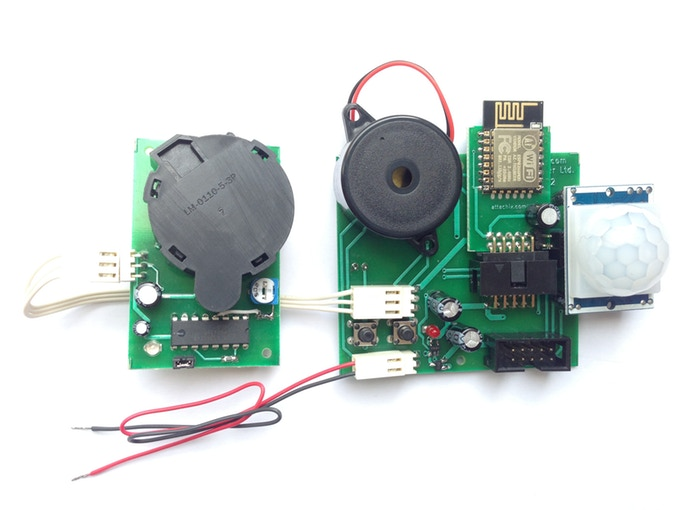
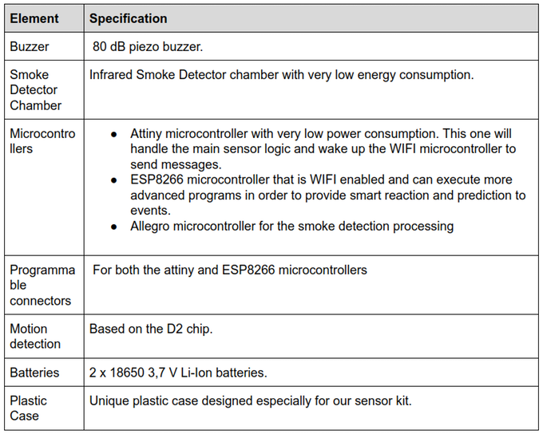

## About
This repository contains the files needed to view, modify and manufacture the Printed Circuit Boards(PCB) for the [U:Kit sensor kit](https://github.com/attachix/ukit) project.

.

## PCBs
U:Kit consists currently of 3 PCBS
* [esp-board/](esp-board/) - ESP8266 PCB.
* [base-board/](base-board/) - the main board in the kit
* [smoke-board/](smoke-board) - the board that operates with the smoke sensor

## Hardware Overview
.

## Required Software
For viewing and modifying the PCBs you will need [KiCad](http://kicad-pcb.org/) version 4.0.5 or newer.
In Ubuntu 16.04 you can install it by typing `sudo apt install kicad`.

### Optional Software
If you want to be able to see better the differences between versions you will need
* gerbv - for differences in Gerber files
* [ImageMagick](https://www.imagemagick.org) - for differences in image files
* diffpdf - for differences in PDF files
* eeplot - for differences in Schema files.

## Copyright
Copyright (c) 2016-2018, Slavey Karadzhov <slav@attachix.com>. All rights reserved.

## Authors
* Cviatko Delchev <cviatko@attachix.com> - Our hard-core hardware guru
* Slavey Karadzhov <slav@attachix.com>
* .. Contributors - See https://github.com/attachix/ukit-pcb/graphs/contributors

## License
All files in this repository are licensed under Creative Commons Non-Commercial-Share Alike 3.0 License . See the [LICENSE](LICENSE) file details. Basically it means that

### You are free to
* Share — copy and redistribute the material in any medium or format
* Adapt — remix, transform, and build upon the material

The licensor cannot revoke these freedoms as long as you follow the license terms.

### Under the following terms:
* Attribution — You must give appropriate credit, provide a link to the license, and indicate if changes were made. You may do so in any reasonable manner, but not in any way that suggests the licensor endorses you or your use.

* NonCommercial — You may not use the material for commercial purposes.

No additional restrictions — You may not apply legal terms or technological measures that legally restrict others from doing anything the license permits.

Credit can be attributed through a link to the creator website: https://attachix.com